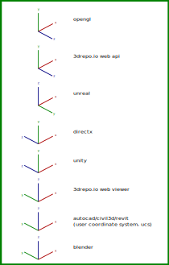

### Notes

Some of these environments also have a concept of forward, right and up. Here are some of those conventions:

|         | forward | up | right |
|---------|---------|----|-------|
| blender | +y      | +z | +x    |
| unity   | +z      | +y | +x    |
| unreal  | +x      | +z | +y    |

### Colour conventions for axes

Generally the color conventions when denoting axes are:

-  `Red - x axis`
-  `Green - y axis`
-  `Blue  - z axis`

### Handedness

This is whether or not the base vectors (axis directions) of the coordinate system follow the [right handed rule](https://mathworld.wolfram.com/Right-HandRule.html), or not.

### Summary

